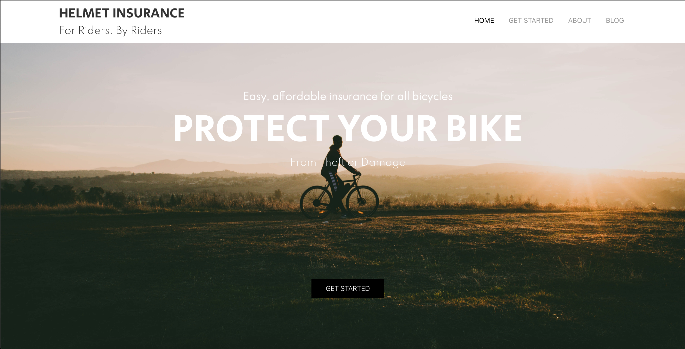
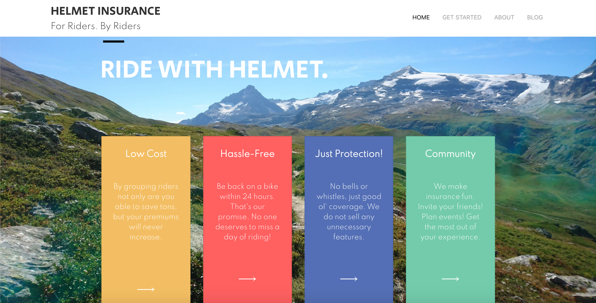
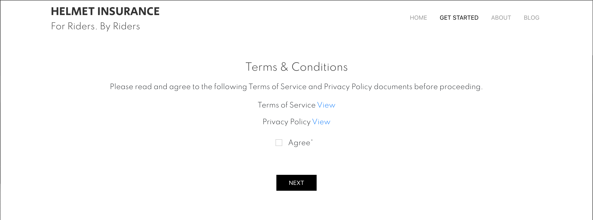
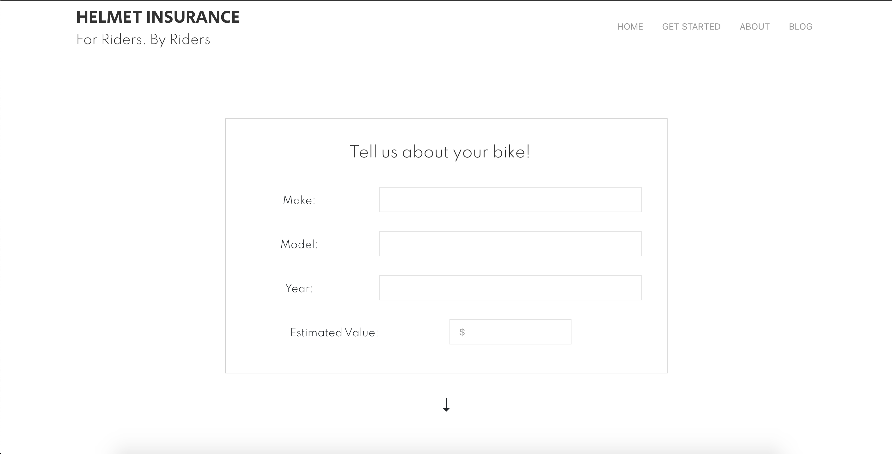
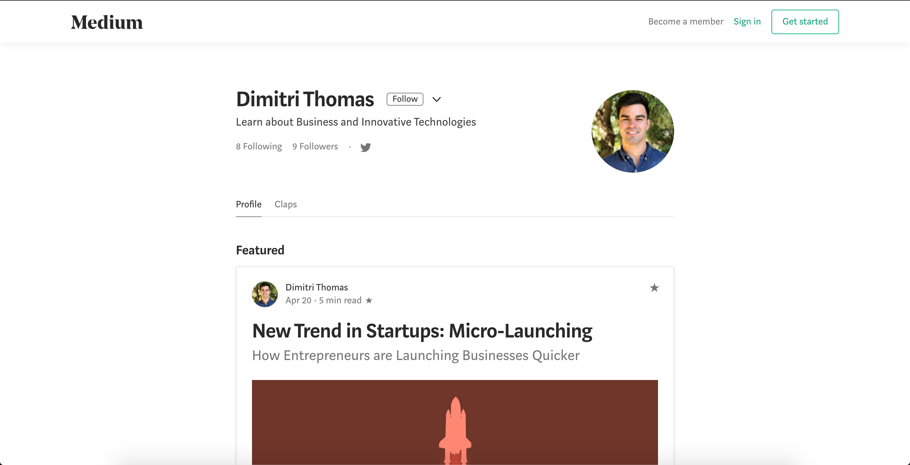

# Helmet Insurance

## Description

Website for an up and coming bike insurance company. Users can learn about the product/its founders, submit details to sign up, and be directed to the founder's blog. 

## Modules/Technologies

1. MongoDB
2. Express
3. React
4. Node
5. Bootstrap
6. UIKit

## Website Components

1. Home page
- Navbar with logo and tabs
    - Responsive hamburger menu
- Sections with information, parallax images, linked buttons, cards
- Bootstrap grid system
2. Get Started (Sign Up) Page
- Required terms and conditions agreement to proceed
- Continuous form
    - Various form elements
- Data saved with MongoDB
3. About Page
4. Blog Tab
- Directs to Medium blog via React router

## User Experience

The home page consists of 3 sections - a top banner, a coverage section, and a section featuring reasons to sign up.
 

The banner features text as well as a button that directs to the sign up page.

The Coverage section is split down the middle, with an image on the right and information on the left. A button will eventually direct users to a page with the different plans offered by the company.

The final section features four cards, each with a reason to "Ride With Helmet", as well as a button that directs to the About page.

Before users can proceed with the sign up process, they must read and accept the Terms of Service and Privacy Policy documents.

The Get Started (sign up) page features a continuous form, broken up into 4 sections (the first is shown here). Once the user has filled out the form and clicked submit, their data is saved via MongoDB.

The Blog tab directs users to the founder's Medium blog.

## Developer Experience

This was my second time creating a website for a real company, and my first time creating a website for a friend. I really enjoyed helping bring someone's vision to life and contributing to the founding of their company. I always enjoy working on MERN applications and working with state variables, and I got to play around with writing script for requiring the user to accept the terms and conditions and creating alerts for/requiring numbers for certain form fields.

-- Sarah Vivoli

